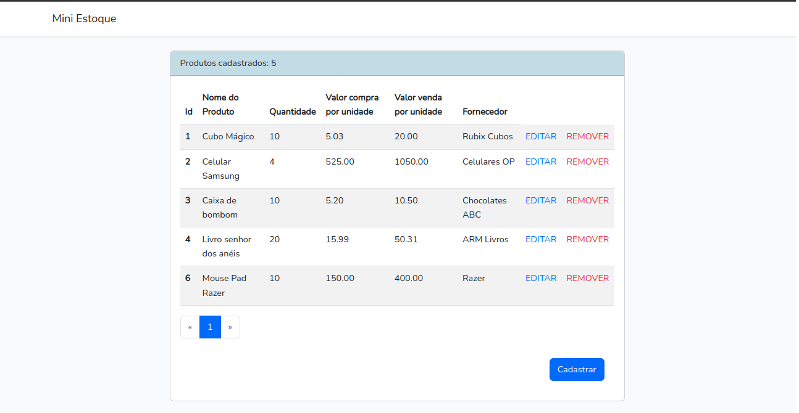

# Mini Controle de Estoque 📦
Este projeto simples, foi desenvolvido para fins de treinamento no framework Laravel e Bootstrap.
Consiste apenas em um sistema simples de CRUD para ampliar meus conhecimentos em Laravel.

## Tela inicial 🖥️

## Aprendizados 📖

Neste projeto, compreendi detalhadamente como devo aplicar um CRUD(Create, Read, Update, Delete) em meu sistema e como isso pode ser implementado em uma grande variedade de sistemas. Também aprendi a usar o método paginate() do Laravel, para separarmos uma quantidade específica de registros a serem apresentados por página.